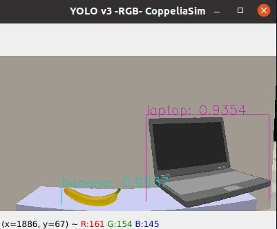

<h1 align="center">
Utilizando a imagem vinda do CoppeliaSim por meio de ROS e tratando com Python+YOLOv3
</h1>

<div align="center">
<h3>
<a href="https://www.linkedin.com/in/beatriz-emiliano/">Beatriz Emiliano Maciel de Sousa</a>
</h3>
</div>

# Guia
- [Descrição](#descrição)
- [Funcionalidades](#funcionalidades)

# Descrição

Este projeto utiliza o simulador CoppeliaSim como ambiente, criando uma cena que simula uma mesa com um notebook e uma banana. Um código em Python é usado para acessar a imagem por meio do ROS (Robot Operating System) e, em seguida, utiliza o YOLOv3 (You Only Look Once version 3) para reconhecer os objetos na imagem que a câmera do CoppeliaSim captura e envia via ROS. O objetivo é mostrar como o reconhecimento de objetos pode ser aplicado em ambientes simulados para aplicações em robótica.


<div align="center">



</div>

# Funcionalidades
- Captura de imagem do ambiente simulado usando ROS
- Utilização do YOLOv3 para reconhecimento de objetos na imagem
- Exibição dos resultados do reconhecimento de objetos na imagem

# Tecnologias utilizadas:
- Python 3.x
- CoppeliaSim
- ROS (Robot Operating System) (ROS Noetic)
- OpenCV
- NumPy
- YOLOv3

# Instalações:
- CoppeliaSim 
```
Use as instruções que contêm no site, eu utilizei a versão EDU
```
<div align="center">

[ Acesse o site aqui ](https://www.coppeliarobotics.com/downloads)

</div>

- ROS 
```
Use as instruções que contêm no site, eu utilizei a versão ROS Noetic
```
<div align="center">

[ Acesse o site aqui ](http://wiki.ros.org/noetic/Installation)

</div>

- YOLOv3

Você vai precisar desses arquivos na sua máquina:

```
  - YoloNames.names
  - yolov3.cfg
  - yolov3.weights
```
