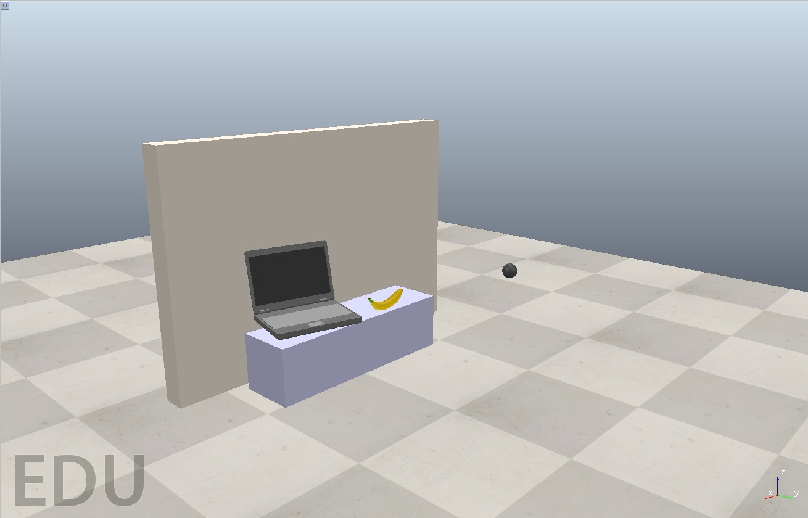
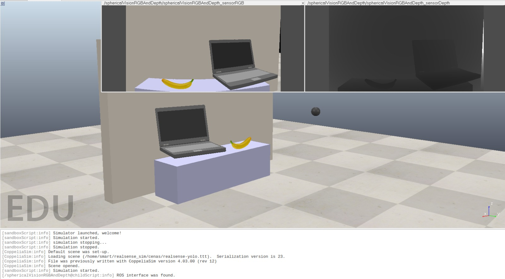
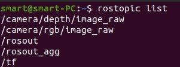
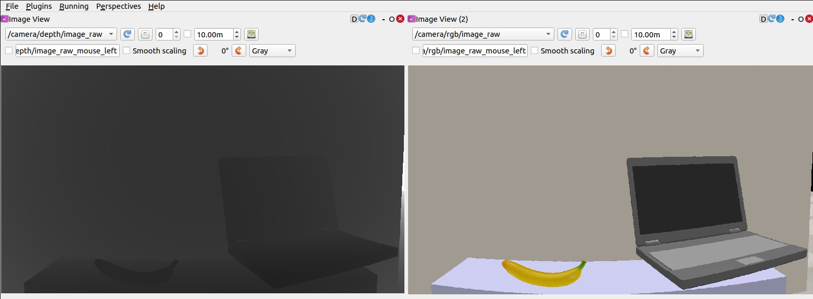
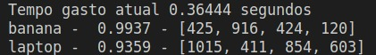

<h1 align="center">
Using CoppeliaSim Image with ROS and Python+YOLOv3 Detection
</h1>

<div align="center">
<h3>
<a href="https://www.linkedin.com/in/beatriz-emiliano/">Beatriz Emiliano Maciel de Sousa</a>
</h3>
</div>

# Guide
- [Description](#description)
- [Features](#features)
- [Technologies used](#technologies-used)
- [Installations](#installations)
- [Application](#application)
- [References](#references)
- [Reference article](#reference-article)

# Description

This project uses the CoppeliaSim simulator as an environment, creating a scene that simulates a table with a notebook and a banana. A Python code is used to access the image through ROS (Robot Operating System) and then uses YOLOv3 (You Only Look Once version 3) to recognize objects in the image that CoppeliaSim's camera captures and sends via ROS. The aim is to show how object recognition can be applied in simulated environments for robotics applications.

<div align="center">


</div>

# Features
- Capture of simulated environment image using ROS
- Use of YOLOv3 for object recognition in the image
- Dissplay of object recognition results in the image

# Technologies used:
- Python 3.x
- CoppeliaSim
- ROS (Robot Operating System) (ROS Noetic)
- OpenCV
- NumPy
- YOLOv3

# Installations:
- CoppeliaSim 
```
Use the instructions on the website, I used the EDU version
```
<div align="center">

[ Acesse o site aqui ](https://www.coppeliarobotics.com/downloads)

</div>

- ROS 
```
Use the instructions on the website, I used the ROS Noetic version
```
<div align="center">

[ Acesse o site aqui ](http://wiki.ros.org/noetic/Installation)

</div>

- YOLOv3

You will need these files on your machine: (Available in the "yoloDados" folder)

```
  - YoloNames.names
  - yolov3.cfg
  - yolov3.weights
```

# Application
- Open a terminal and set up the ROS development environment and run the roscore for nodes to communicate:
```
$ source /opt/ros/noetic/setup.bash
$ roscore
```
- Open the CoppeliaSim software:
```
$ source /opt/ros/noetic/setup.bash
$ cd ~/yolov3_ros_coppeliasim/CoppeliaSim
$ ./coppeliaSim.sh
```
- Load the scene: 
```
File > Open scene... >> realsense-yolo.ttt
```


- Run the scene:



- To check if the image has been published, execute the command, in the terminal:
```
$ source /opt/ros/noetic/setup.bash
$ rostopic list
```

<div align="center">



</div>

- Another way to check is to run the "rqt" command to be able to visualize the image:



- Now let's run the Python code, in another terminal:
```
$ source /opt/ros/noetic/setup.bash
$ cd /yolov3_ros_copelliasim/scripts
$ python3 yolov3_ros_coppeliasim.py
```
- You should have as output the window with the objects recognized in the scene and in the terminal the description:

<div align="center">




</div>

# References
- [YOLOv3](https://pjreddie.com/darknet/yolo/)
- [CoppeliaSim](https://www.coppeliarobotics.com/)
- [ROS](https://www.ros.org/)

# Reference article:
- Redmon, Joseph, and Ali Farhadi. "YOLOv3: An Incremental Improvement." arXiv preprint arXiv:1804.02767 (2018).
